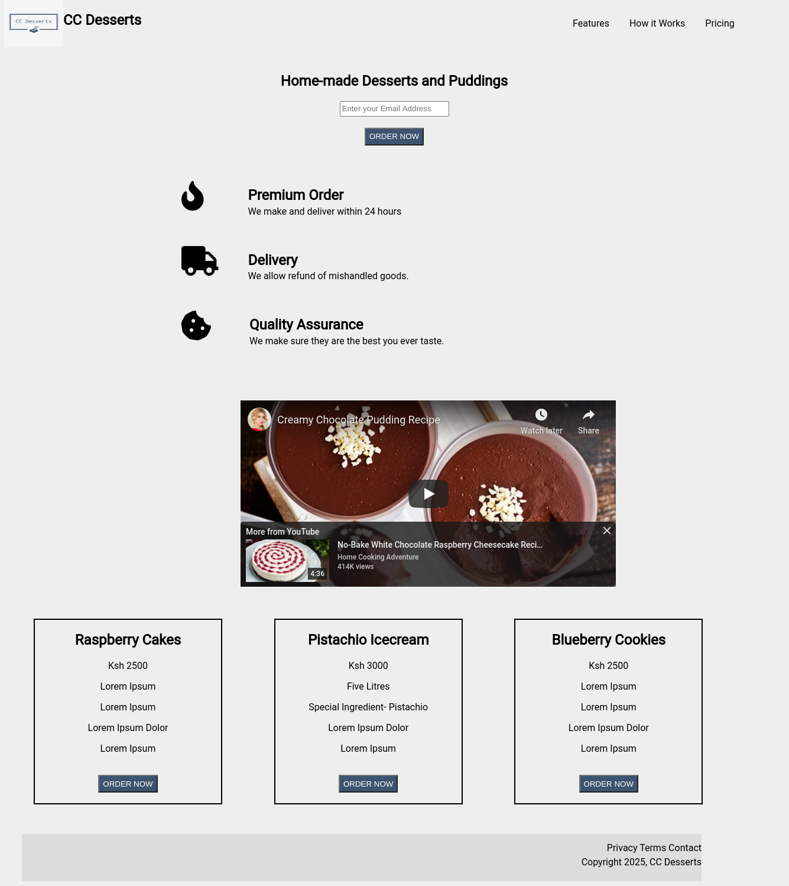
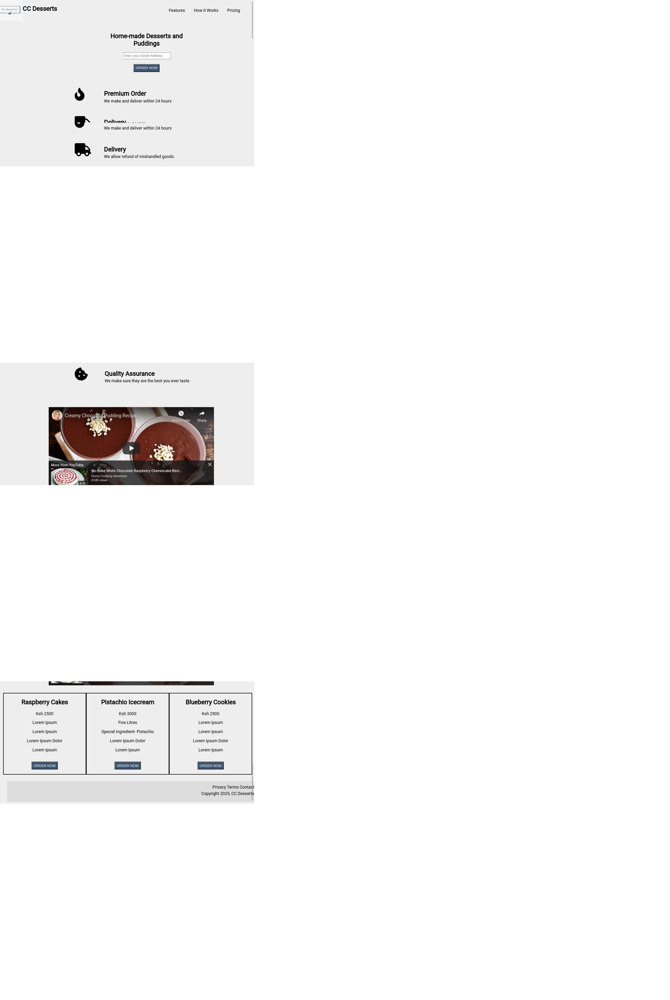

# Product Landing Page

> Creating a [Product Landing Page](https://www.freecodecamp.org/learn/responsive-web-design/responsive-web-design-projects/build-a-product-landing-page) using languages leant in FreeCodeCamp's responsive web design projects.

## Built With

- HTML
- CSS3

## Live Demo

[Live Demo Link](https://livedemo.com)

## Authors

👤 **Author1**

- Github: [@kyendereta](https://github.com/kyendereta)
- Twitter: [@cckyendereta](https://twitter.com/cckyendereta)
- Linkedin: [Chantelle Kyendereta](https://www.linkedin.com/in/chantelle-kyendereta-70993719b/)

## 🤝 Contributing

Contributions, issues and feature requests are welcome!

Feel free to check the [issues page](issues/kyendereta).

## Show your support

Give a ⭐️ if you like this project!

## Acknowledgments

- FreeCodeCamp
- Inspiration and full support from [Ijay Abby](https://github.com/IjayAbby)

## 📝 License
